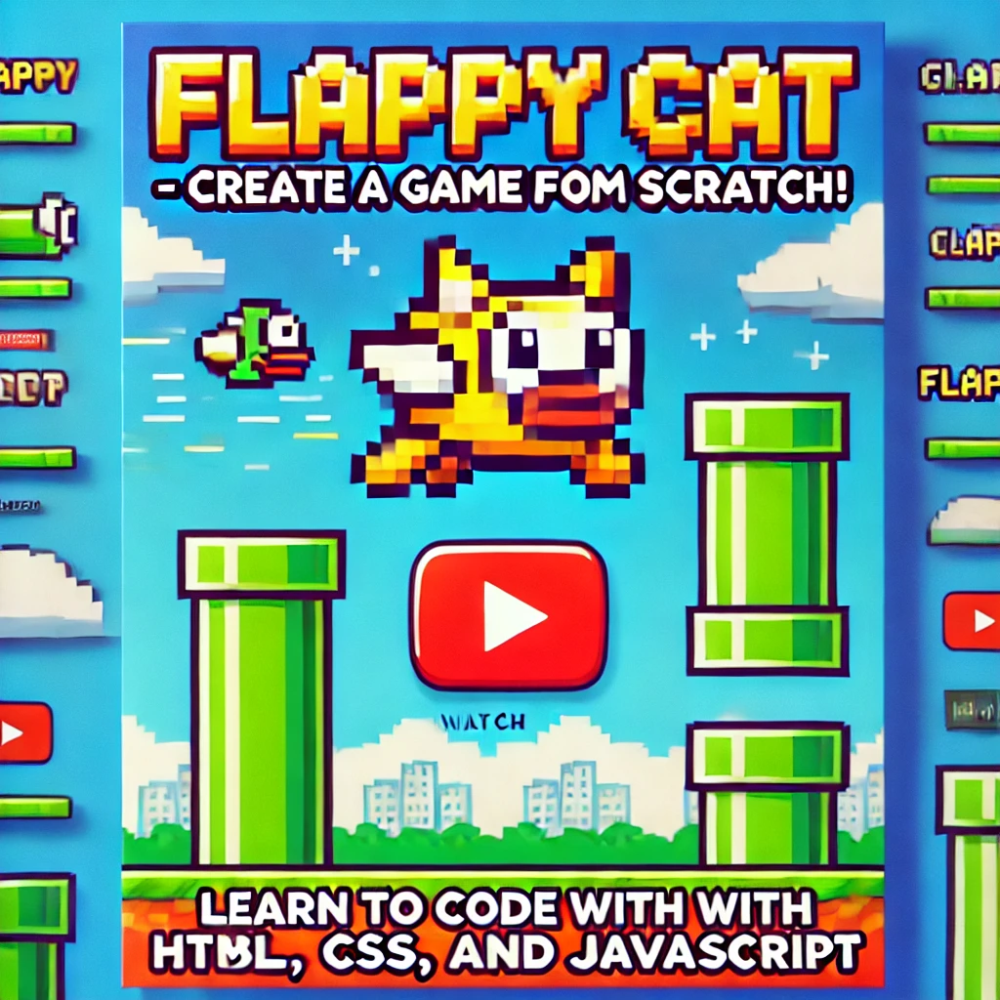
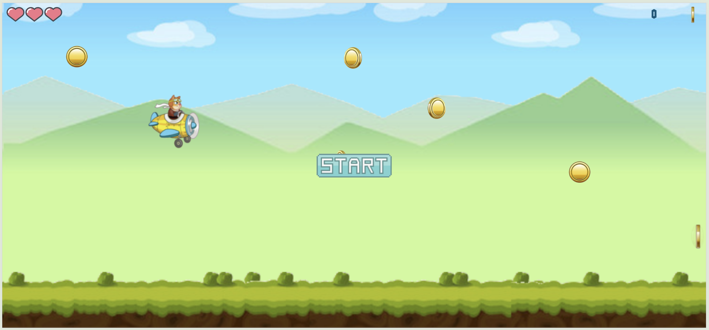
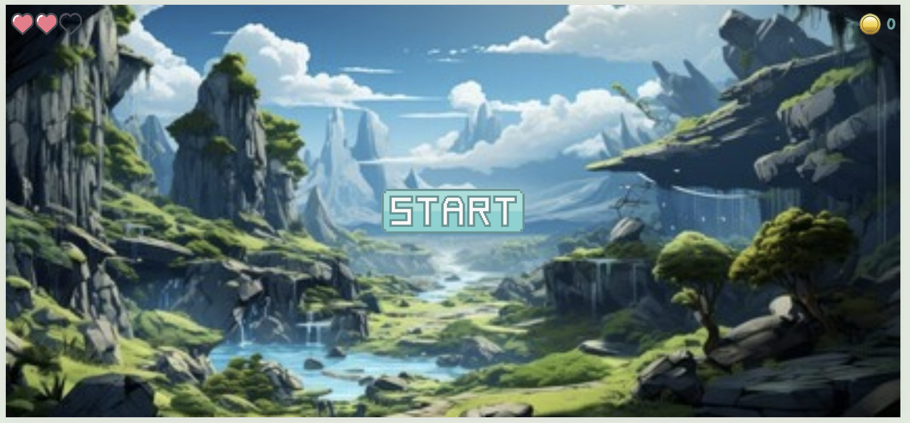
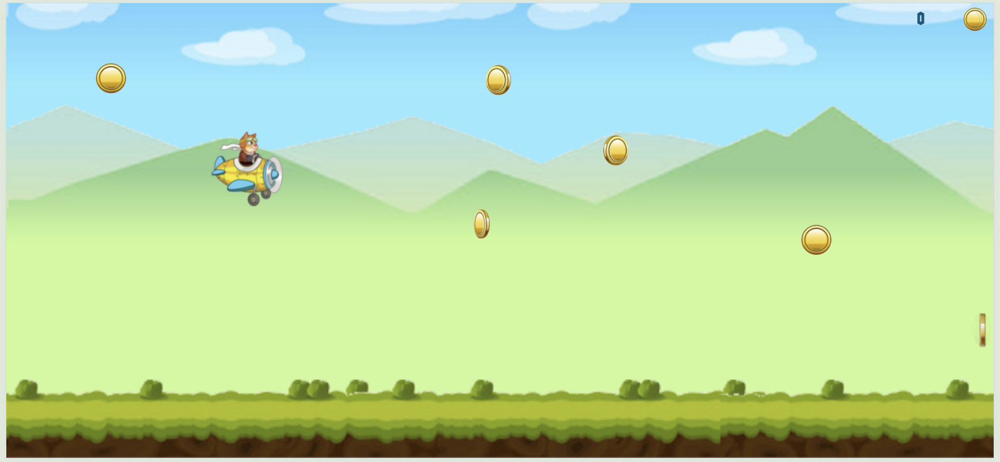
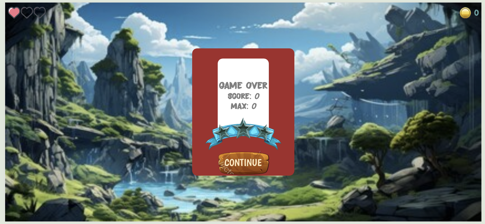

# Flappy Cat 2D Game

🎮 Flappy Cat - Sıfırdan HTML, CSS və JavaScript ilə hazırlanmış sadə və əyləncəli bir oyun! 🐱

Bu layihədə, HTML, CSS və JavaScript istifadə edərək Flappy Cat adlı 2D oyununu sıfırdan yaratdım. Oyun mexanikası, əngəllərin yaradılması, xal sistemi və çarpışmaların işlənməsi ilə bağlı təcrübə qazandım.



## Nələr öyrəndim?

- Oyun mexanikası qurulması: Uçuş və cazibə qüvvəsi
- Əngəllər və xal sistemi yaradılması
- Çarpışmaların işlənməsi və oyun bitmə məntiqi
- Sadə, lakin funksional bir menyu sisteminin əlavə edilməsi
- Oyun optimallaşdırma və kod yazma təcrübələri

## Layihə haqqında

Bu oyun, HTML, CSS və JavaScript istifadə edərək hazırlanıb. İstifadəçilər, "Flappy Cat" adlı pişik obrazını ekranda hərəkət etdirərək müxtəlif əngəlləri keçməyə çalışırlar. Uçuş mexanikası, cazibə qüvvəsi ilə idarə olunur və istifadəçilərin xal toplaya biləcəyi əngəllər mövcuddur.

## Özünə Quraşdırma

1. Bu layihəni öz cihazınıza yükləmək üçün GitHub reposunu klonlayın:

   ```bash
   git clone https://github.com/avazalijamal/Flappy-Cat-Game.git
   ```

2. Layihə qovluğuna daxil olun:

   ```bash
   cd Flappy-Cat-Game
   ```

3. Oyun fayllarını açın və brauzerinizdə `index.html` faylını işə salaraq oyunu oynayın.

## Ekran Görüntüləri

Aşağıda oyunun müxtəlif mərhələlərindən ekran görüntülərini tapa bilərsiniz:

### Başlanğıc Menyu





### Oyun Ekranı



### Oyun Bitdikdən Sonra Nəticə



## Təsvir

- **Oyun Mexanikası**: Oyunçu, pişiyi yuxarı doğru hərəkət etdirərək əngəllərdən keçməyə çalışır. Hər bir əngəl keçildikdə xal yığılır.
- **Menyu Sistemi**: Oyunda başlanğıc və oyun bitdikdən sonra sadə bir menyu görünür.
- **Xal Sistemi**: Əngəllər keçildikcə xal yığılır və oyun bitəndə nəticə göstərilir.

## Gəlişdirmə

- **Oyun Mexanikası**: Pişiyin hərəkəti cazibə qüvvəsi ilə idarə olunur; istifadəçi siçanla basdıqda pişik yuxarı sıçrayır.
- **Əngəllər**: Təsadüfi ölçülərdə yaradılan əngəllərdən qaçmaq.
- **Kodun İstifadəsi**: Oyun sıfırdan yazılmış sadə və oxunaqlı JavaScript kodu ilə hazırlanıb.

## Gələcək Yeniliklər

- Yeni səviyyələr və çətinlik dərəcələri əlavə etmək
- Dəyişən oyun mühiti
- Oyunçular üçün fərdi inkişaf sistemləri

## Əlaqə

- GitHub: [Flappy Cat 2D Game Repository](https://github.com/avazalijamal/Flappy-Cat-Game)
- E-mail: [avazalijamal@gmail.com](mailto:avazalijamal@gmail.com)

## Lisenziya

Bu layihə [MIT Lisenziyası](https://opensource.org/licenses/MIT) altında lisenziyalaşdırılıb.

---

Hadi, kodlayaq və öz oyunumuzu yaradaq! 🚀
